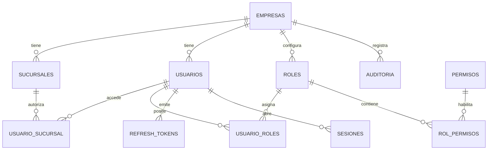

# Taller 360

Taller 360 es una plataforma SaaS multiempresa y multisucursal para administracion integral de talleres automotrices.

## 1. Arquitectura propuesta

- **Frontend:** Next.js + React + TypeScript. UI responsive, login, selector de sucursal, layout privado, dashboard y menu dinamico segun permisos.
- **Backend:** Java 21 + Spring Boot 3, arquitectura modular por dominio: `auth`, `organization`, `iam`, `audit` y modulos futuros.
- **Base de datos:** PostgreSQL con Flyway para migraciones versionadas.
- **Autenticacion:** Spring Security, JWT access token y refresh token persistente.
- **Sesiones:** tabla `sesiones` para sesiones activas, revocacion y trazabilidad por IP/user-agent.
- **Cache:** Redis disponible en la infraestructura para sesiones/cache/rate limits futuros.
- **Archivos:** configuracion preparada para almacenamiento compatible con S3.
- **Documentacion API:** OpenAPI/Swagger en `/swagger-ui.html`.
- **Contenedores:** Docker Compose levanta PostgreSQL, Redis, backend y frontend.

## 2. Estructura de carpetas

```text
backend/
  src/main/java/com/taller360/
    auth/            Login, refresh, logout, password recovery, sesiones
    organization/    Empresas y sucursales
    iam/             Usuarios, roles, permisos y RBAC dinamico
    audit/           Auditoria append-only
    common/          Seguridad, tenant context y utilidades compartidas
    config/          Spring Security, OpenAPI, CORS
  src/main/resources/db/migration/
frontend/
  src/app/           Rutas Next.js
  src/components/    Componentes de UI
  src/lib/           Cliente API y helpers de permisos
infra/
docker-compose.yml
```

## 3. Modelo de datos

Todas las tablas usan UUID. Los registros operativos contienen `empresa_id` y, cuando aplica, `sucursal_id`. El backend valida el tenant desde el token y no confia en filtros enviados por el cliente.

Tablas iniciales:

- `empresas`
- `sucursales`
- `usuarios`
- `usuario_sucursal`
- `roles`
- `permisos`
- `usuario_roles`
- `rol_permisos`
- `refresh_tokens`
- `sesiones`
- `auditoria`
- `password_reset_tokens`

## 4. Diagrama de entidades



## 5. APIs implementadas

- `POST /api/v1/auth/login`
- `POST /api/v1/auth/refresh`
- `POST /api/v1/auth/logout`
- `POST /api/v1/auth/forgot-password`
- `POST /api/v1/auth/reset-password`
- `GET /api/v1/auth/me`
- `GET /api/v1/auth/sessions`
- `DELETE /api/v1/auth/sessions/{id}`
- `GET /api/v1/companies`
- `GET /api/v1/branches`
- `GET /api/v1/users`
- `POST /api/v1/users`
- `GET /api/v1/roles`
- `POST /api/v1/roles`
- `GET /api/v1/permissions`

## 6. Componentes y pantallas

- Login Taller 360 con email, password, mostrar/ocultar password, recordarme y estados de error.
- Selector de sucursal cuando el usuario tiene mas de una sucursal.
- Layout privado con sidebar dinamico por permisos, topbar, notificaciones, perfil y logout.
- Dashboard base con metricas en cero hasta que existan los modulos reales.

## 7. Plan de implementacion

1. Crear monorepo y contenedores.
2. Crear migraciones iniciales multiempresa.
3. Implementar entidades, repositorios y RBAC dinamico.
4. Implementar autenticacion, refresh tokens, sesiones y bloqueo temporal.
5. Implementar endpoints base y OpenAPI.
6. Crear frontend responsive conectado al backend.
7. Agregar pruebas de seguridad multiempresa y autenticacion.
8. Dejar arquitectura preparada para modulos futuros.

## Levantar localmente

```bash
docker compose -f infra/docker-compose.yml up --build
```

Servicios:

- Frontend: `http://localhost:3000`
- Backend: `http://localhost:8080`
- Swagger: `http://localhost:8080/swagger-ui.html`
- PostgreSQL: `localhost:5432`
- Redis: `localhost:6379`

Usuario seed:

- Email: `admin@taller360.local`
- Password: `Admin123!`

## Despliegue en Render

El repositorio incluye [render.yaml](render.yaml) para crear:

- `taller360-postgres`: base de datos PostgreSQL administrada por Render.
- `taller360-redis`: instancia Key Value compatible con Redis para cache.
- `taller360-backend`: servicio web Docker con Spring Boot.
- `taller360-frontend`: servicio web Docker con Next.js.

Pasos:

1. Subir este repositorio a GitHub.
2. En Render, crear un nuevo **Blueprint** apuntando al repositorio.
3. Render solicitara valores para variables marcadas con `sync: false`:
   - `APP_CORS_ALLOWED_ORIGINS`: URL publica del frontend, por ejemplo `https://taller360-frontend.onrender.com`.
   - `NEXT_PUBLIC_API_URL`: URL publica del backend con prefijo API, por ejemplo `https://taller360-backend.onrender.com/api/v1`.
4. Render genera automaticamente `JWT_SECRET`.
5. Flyway ejecuta las migraciones al iniciar el backend y crea las tablas/seed inicial.

Render asigna la variable `PORT` automaticamente. El backend usa `server.port=${PORT}` y el frontend inicia Next.js con `-p ${PORT}`.

Si creas los servicios manualmente en lugar de usar Blueprint:

- Backend:
  - Runtime: Docker.
  - Root Directory: `backend`.
  - Dockerfile Path: `./Dockerfile`.
  - Docker Context: `.`.
- Frontend:
  - Runtime: Docker.
  - Root Directory: `frontend`.
  - Dockerfile Path: `./Dockerfile`.
  - Docker Context: `.`.

El error `failed to read dockerfile: open Dockerfile: no such file or directory` aparece cuando Render intenta construir desde la raiz del repositorio sin `rootDir`, porque los Dockerfile viven dentro de `backend/` y `frontend/`.

## Desarrollo sin Docker

Backend:

```bash
cd backend
./mvnw spring-boot:run
```

Frontend:

```bash
cd frontend
npm install
npm run dev
```
