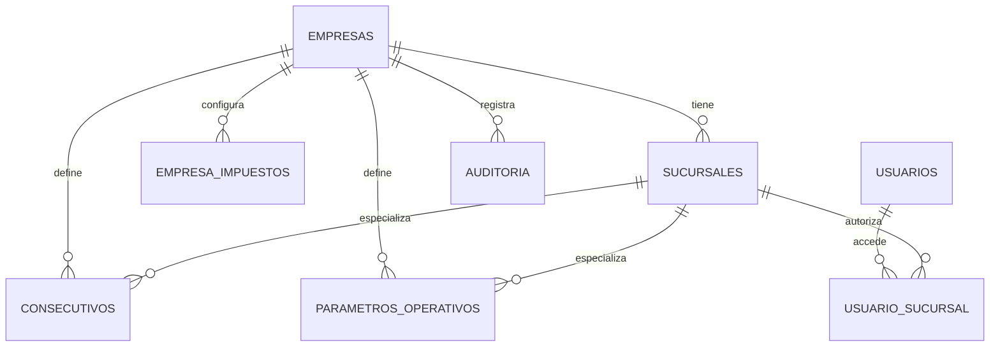

# M02 - Empresas y sucursales

## Dependencias identificadas

- **M01 Auth:** provee usuario autenticado, access token, refresh token y sucursal actual.
- **IAM/RBAC:** provee permisos dinamicos como `EMPRESAS:VER`, `SUCURSALES:CREAR`, `PARAMETROS:EDITAR`.
- **Auditoria:** existia tabla append-only `auditoria`; M02 agrega `AuditPort` y adaptador JPA.
- **Modulos futuros:** clientes, vehiculos, ordenes, caja y facturacion deberan usar `empresa_id` y, cuando aplique, `sucursal_id`.

No se agregaron dependencias a modulos futuros. El contexto tenant queda disponible mediante `TenantContext`.

## Historias de usuario y criterios de aceptacion

1. Como administrador quiero ver y editar los datos operativos de mi empresa para mantener moneda, zona horaria y datos fiscales actualizados.
   - Solo usuarios con `EMPRESAS:VER` o `CONFIGURACION:VER` consultan.
   - Solo usuarios con `EMPRESAS:EDITAR` o `CONFIGURACION:EDITAR` editan.
   - No se puede editar una empresa distinta al tenant autenticado.

2. Como administrador quiero crear y mantener sucursales para operar varias sedes.
   - Cada sucursal pertenece a una empresa.
   - El codigo de sucursal es unico dentro de la empresa.
   - El borrado es logico: deja la sucursal `INACTIVA` y sin operacion.

3. Como administrador quiero configurar impuestos para reutilizarlos en cotizaciones y facturacion.
   - Codigo de impuesto unico por empresa.
   - Porcentaje mayor o igual a cero.
   - Se auditan altas y cambios.

4. Como administrador quiero definir consecutivos por empresa o sucursal para documentos futuros.
   - Documento unico por empresa/sucursal.
   - Siguiente numero positivo.
   - Longitud entre 1 y 20.
   - La vista previa se calcula como `prefijo + numero con ceros`.

5. Como usuario con varias sucursales quiero cambiar la sucursal activa.
   - El selector solo muestra sucursales autorizadas.
   - El backend valida `X-Branch-Id` o la sucursal del token contra el usuario.

## Modelo entidad-relacion



Migracion:

- `V3__m02_organization_settings.sql`
  - Agrega `moneda`, `zona_horaria`, contacto y direccion a empresas.
  - Agrega `codigo`, `moneda`, `zona_horaria`, email y operatividad a sucursales.
  - Crea `empresa_impuestos`, `consecutivos`, `parametros_operativos`.
  - Inserta permisos `EMPRESAS`, `IMPUESTOS`, `CONSECUTIVOS`, `PARAMETROS`.

## API REST y contratos DTO

- `GET /api/v1/companies`
- `POST /api/v1/companies`
- `PUT /api/v1/companies/{id}`
- `DELETE /api/v1/companies/{id}`
- `GET /api/v1/branches`
- `POST /api/v1/branches`
- `PUT /api/v1/branches/{id}`
- `DELETE /api/v1/branches/{id}`
- `GET /api/v1/taxes`
- `POST /api/v1/taxes`
- `PUT /api/v1/taxes/{id}`
- `DELETE /api/v1/taxes/{id}`
- `GET /api/v1/consecutives`
- `POST /api/v1/consecutives`
- `PUT /api/v1/consecutives/{id}`
- `DELETE /api/v1/consecutives/{id}`
- `GET /api/v1/operational-parameters`
- `POST /api/v1/operational-parameters`
- `PUT /api/v1/operational-parameters/{id}`
- `DELETE /api/v1/operational-parameters/{id}`

DTOs backend:

- `CompanyRequest`, `CompanyResponse`
- `BranchRequest`, `BranchResponse`
- `TaxRequest`, `TaxResponse`
- `ConsecutiveRequest`, `ConsecutiveResponse`
- `ParameterRequest`, `ParameterResponse`

## Servicios de dominio y reglas

- `OrganizationService` centraliza reglas y evita consultas cruzadas.
- Toda busqueda mutable usa `id + empresa_id`.
- `TenantContextFilter` crea contexto por request con usuario, empresa, sucursal, IP, user-agent y correlation id.
- `TenantGuard` valida acceso a sucursal.
- El selector de sucursal usa `POST /api/v1/auth/refresh` para emitir token con nueva sucursal.

## Pantallas/componentes

- `frontend/src/app/configuracion/page.tsx`
  - Tabs: Empresa, Sucursales, Impuestos, Consecutivos, Parametros.
  - Estados vacios para listas sin datos.
  - Formulario responsive de empresa y creacion de sucursal.
- `frontend/src/components/AppLayout.tsx`
  - Selector de sucursal en topbar para usuarios con multiples sucursales.

## Matriz de permisos

| Recurso | VER | CREAR | EDITAR | ELIMINAR | EXPORTAR |
| --- | --- | --- | --- | --- | --- |
| EMPRESAS | Si | Si | Si | Desactivacion logica | Futuro |
| SUCURSALES | Si | Si | Si | Borrado logico | Futuro |
| IMPUESTOS | Si | Si | Si | Desactivacion logica | Futuro |
| CONSECUTIVOS | Si | Si | Si | Desactivacion logica | Futuro |
| PARAMETROS | Si | Si | Si | Eliminacion controlada | Futuro |

El frontend puede ocultar opciones, pero la autorizacion obligatoria esta en backend con `@PreAuthorize`.

## Eventos y auditoria

M02 registra:

- `EMPRESAS:CREAR`, `EMPRESAS:EDITAR`, `EMPRESAS:ELIMINAR`
- `SUCURSALES:CREAR`, `SUCURSALES:EDITAR`, `SUCURSALES:ELIMINAR`
- `IMPUESTOS:CREAR`, `IMPUESTOS:EDITAR`, `IMPUESTOS:ELIMINAR`
- `CONSECUTIVOS:CREAR`, `CONSECUTIVOS:EDITAR`, `CONSECUTIVOS:ELIMINAR`
- `PARAMETROS:CREAR`, `PARAMETROS:EDITAR`, `PARAMETROS:ELIMINAR`

La auditoria incluye usuario, empresa, sucursal, fecha, IP, user-agent, modulo, accion, entidad, registro, valores y correlation id.

## Pruebas

Unitarias:

- `TenantContextTest`: set/clear de contexto.
- `AuthServiceTest`: sucursal no autorizada y empresa actual.

Integracion/seguridad pendientes para ampliar cuando exista Testcontainers o perfil H2:

- CRUD empresa/sucursal.
- Usuario de empresa A intentando consultar sucursal de empresa B.
- `X-Branch-Id` no autorizado.
- Usuario sin permisos.
- Auditoria creada en cambios.

E2E pendiente:

- Login, seleccion de sucursal, entrada a Configuracion, edicion empresa, creacion sucursal.

## Ejecucion y prueba manual

```bash
docker compose -f infra/docker-compose.yml up --build
```

Login seed:

```text
admin@taller360.local
Admin123!
```

Flujo:

1. Abrir frontend.
2. Iniciar sesion.
3. Seleccionar sucursal.
4. Ir a Configuracion.
5. Ver empresa/sucursales.
6. Crear sucursal o editar empresa.

## Errores y estados vacios

- Validacion de dominio: HTTP 400 con `message`.
- Acceso cruzado o sucursal no autorizada: HTTP 403.
- Listas sin registros muestran mensaje vacio, no datos ficticios.
