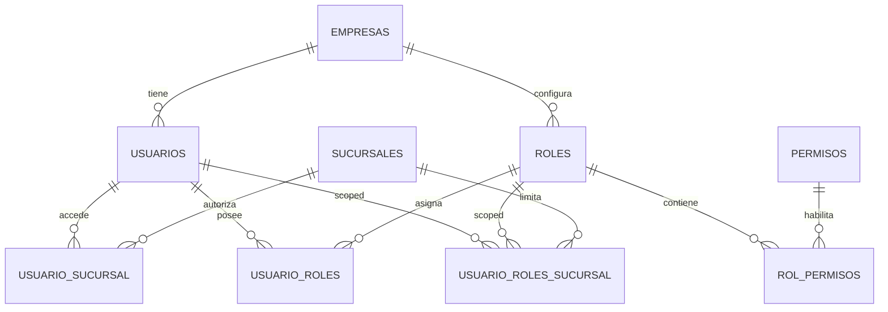

# M03 - Usuarios, roles y permisos

## Dependencias identificadas

- **M01 Auth:** autentica usuarios, emite JWT y reconstruye permisos en cada login/refresh.
- **M02 Empresas y sucursales:** define tenant, sucursales disponibles y `TenantContext`.
- **Auditoria:** M03 usa `AuditPort` para registrar cambios de usuarios, roles y matriz.

No se agregaron dependencias a modulos futuros. Las policies quedan expresadas como permisos `RECURSO:ACCION` y se validan en backend con `@PreAuthorize`.

## Historias de usuario y criterios de aceptacion

1. Como administrador quiero crear usuarios y asignarles sucursales.
   - El usuario creado pertenece a la empresa actual.
   - Solo se pueden asignar sucursales del tenant actual.
   - La contrasena es obligatoria al crear.

2. Como administrador quiero crear roles personalizados.
   - Los roles pertenecen a la empresa actual, salvo roles globales seed.
   - Los permisos se seleccionan de la matriz dinamica.
   - Se auditan altas, ediciones y desactivaciones.

3. Como administrador quiero asignar roles por empresa o sucursal.
   - Una asignacion sin sucursal aplica a toda la empresa.
   - Una asignacion con sucursal solo aplica cuando esa sucursal esta activa en el token.
   - El backend recalcula authorities en login/refresh.

4. Como administrador quiero ver una matriz de permisos.
   - La matriz cruza recursos, acciones y roles.
   - Los estados vacios no muestran datos ficticios.

## Modelo entidad-relacion



Migracion:

- `V4__m03_iam_scope.sql`
  - Agrega `estado`, `alcance`, fechas a `roles`.
  - Crea `usuario_roles_sucursal`.
  - Agrega recurso `PERMISOS` con acciones `VER`, `CREAR`, `EDITAR`, `ELIMINAR`, `APROBAR`, `ASIGNAR`, `EXPORTAR`, `ANULAR`.

## API REST y contratos DTO

- `GET /api/v1/users`
- `POST /api/v1/users`
- `PUT /api/v1/users/{id}`
- `DELETE /api/v1/users/{id}`
- `GET /api/v1/roles`
- `POST /api/v1/roles`
- `PUT /api/v1/roles/{id}`
- `DELETE /api/v1/roles/{id}`
- `GET /api/v1/permissions`
- `GET /api/v1/permissions/matrix`

DTOs:

- `UserRequest`, `UserResponse`
- `RoleRequest`, `RoleResponse`
- `RoleAssignmentRequest`, `RoleAssignmentResponse`
- `PermissionResponse`
- `PermissionMatrixResponse`, `RoleMatrixResponse`

## Servicios de dominio y reglas

- `IamService` centraliza reglas de usuarios, roles, permisos y asignaciones scoped.
- No se permite asignar sucursales de otra empresa.
- No se permite modificar roles de otra empresa.
- Roles globales pueden consultarse; roles empresariales son del tenant.
- `SecurityUserFactory` respeta roles scoped por sucursal al crear authorities.
- Las policies de endpoint se expresan con `@PreAuthorize("@perm.has(authentication, 'RECURSO:ACCION')")`.

## Pantallas/componentes

En `frontend/src/app/configuracion/page.tsx`:

- Tab **Usuarios:** alta de usuario, sucursales y rol con alcance opcional por sucursal.
- Tab **Roles:** alta de rol y selector de permisos.
- Tab **Permisos:** matriz recurso/accion por rol.

## Matriz de permisos aplicable

| Recurso | Acciones |
| --- | --- |
| USUARIOS | VER, CREAR, EDITAR, ELIMINAR, EXPORTAR |
| ROLES | VER, CREAR, EDITAR, ELIMINAR, EXPORTAR |
| PERMISOS | VER, CREAR, EDITAR, ELIMINAR, APROBAR, ASIGNAR, EXPORTAR, ANULAR |

La validacion real ocurre en backend. Ocultar controles en frontend no es seguridad.

## Eventos y auditoria

- `USUARIOS:CREAR`, `USUARIOS:EDITAR`, `USUARIOS:ELIMINAR`
- `ROLES:CREAR`, `ROLES:EDITAR`, `ROLES:ELIMINAR`

Cada evento guarda usuario, empresa, sucursal actual, IP, user-agent, entidad, registro y valores anterior/nuevo.

## Pruebas

Unitarias:

- `PermissionEvaluatorTest`
- `TenantContextTest`

Pendientes al agregar Testcontainers/perfil de integracion:

- Usuario sin `USUARIOS:VER` recibe 403.
- Usuario de empresa A no puede editar usuario/rol de empresa B.
- Rol scoped a sucursal A no concede permisos en sucursal B.
- Matriz vacia muestra estado vacio.
- E2E: login, configuracion, crear rol, crear usuario, validar matriz.

## Ejecucion

```bash
docker compose -f infra/docker-compose.yml up --build
```

Credenciales seed:

```text
admin@taller360.local
Admin123!
```

Pasos manuales:

1. Iniciar sesion.
2. Seleccionar sucursal.
3. Ir a Configuracion.
4. Abrir Usuarios, Roles o Permisos.
5. Crear rol personalizado y asignarlo a un usuario.
