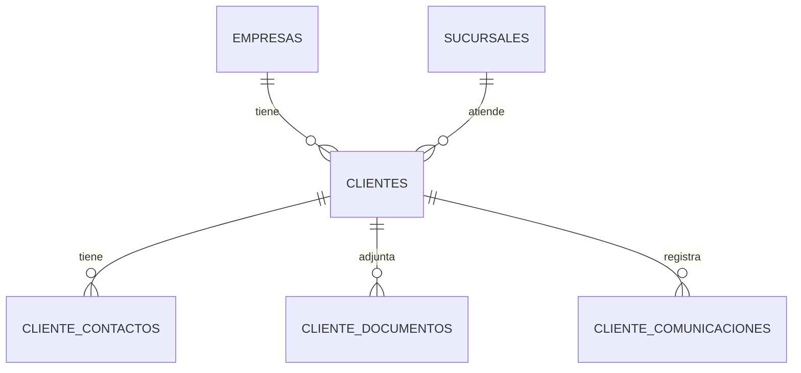

# M04 - Clientes

## Dependencias identificadas

- **M01 Auth:** usuario autenticado y permisos `CLIENTES:*`.
- **M02 Empresas/Sucursales:** tenant, sucursal actual y validacion de sucursal.
- **M03 RBAC:** policies `CLIENTES:VER`, `CLIENTES:CREAR`, `CLIENTES:EDITAR`, `CLIENTES:ELIMINAR`, `CLIENTES:EXPORTAR`.
- **Auditoria:** registro de altas, cambios, desactivaciones y elementos de ficha.
- **Modulos futuros:** Vehiculos, Citas, OT, Facturas y Pagos aun no existen. M04 define `Client360ExternalPort` y un stub vacio `EmptyClient360ExternalPort`.

## Historias de usuario y criterios de aceptacion

1. Como asesor quiero crear clientes con datos de contacto para identificarlos rapidamente.
   - Nombre obligatorio.
   - Todo cliente se guarda con `empresa_id`.
   - `sucursal_id` debe pertenecer al tenant si se envia.

2. Como asesor quiero buscar clientes por nombre, identificacion, telefono, WhatsApp, email o placa relacionada.
   - La busqueda textual filtra solo clientes de la empresa actual.
   - La busqueda por placa usa un puerto hacia el modulo Vehiculos; mientras no exista, devuelve vacio sin inventar datos.

3. Como asesor quiero ver una Ficha 360 del cliente.
   - Muestra datos, contactos, documentos, comunicaciones y cartera.
   - Vehiculos/citas/OT/facturas/pagos muestran estados vacios hasta que existan sus modulos.

4. Como administrador quiero desactivar clientes sin perder historial.
   - `DELETE /clients/{id}` cambia `estado` a `INACTIVO`.
   - Se audita el cambio.

## Modelo entidad-relacion



Migracion:

- `V5__m04_clients.sql`
  - `clientes`
  - `cliente_contactos`
  - `cliente_documentos`
  - `cliente_comunicaciones`
  - indices por empresa, nombre, identificacion, telefono, email y sucursal.

## API REST y contratos DTO

- `GET /api/v1/clients?q=&plate=`
- `GET /api/v1/clients/{id}`
- `POST /api/v1/clients`
- `PUT /api/v1/clients/{id}`
- `DELETE /api/v1/clients/{id}`
- `POST /api/v1/clients/{id}/contacts`
- `POST /api/v1/clients/{id}/documents`
- `POST /api/v1/clients/{id}/communications`

DTOs:

- `ClientRequest`, `ClientResponse`
- `ContactRequest`, `ContactResponse`
- `DocumentRequest`, `DocumentResponse`
- `CommunicationRequest`, `CommunicationResponse`
- `Client360Response`, `RelatedItem`, `PortfolioSummary`

## Servicios de dominio y reglas

- `ClientService` aplica tenant en todas las consultas.
- `clientInTenant` bloquea acceso cruzado.
- `branchInTenant` valida sucursal autorizada.
- `Client360ExternalPort` desacopla dependencias no implementadas.

## Pantallas/componentes

- `frontend/src/app/clientes/page.tsx`
  - Busqueda por texto y placa.
  - Listado con estado vacio.
  - Formulario de creacion.
  - Ficha 360 responsive.

## Matriz de permisos

| Recurso | VER | CREAR | EDITAR | ELIMINAR | EXPORTAR |
| --- | --- | --- | --- | --- | --- |
| CLIENTES | Lista/Ficha 360 | Crear cliente/contactos/documentos/comunicaciones | Editar cliente | Desactivar | Futuro |

## Eventos/auditoria

- `CLIENTES:CREAR` en `clientes`
- `CLIENTES:EDITAR` en `clientes`
- `CLIENTES:ELIMINAR` en `clientes`
- `CLIENTES:CREAR` en contactos/documentos/comunicaciones

## Pruebas

Unitarias:

- `ClientServiceValidationTest`: documenta validacion de nombre requerido.

Pendientes para integracion/Testcontainers:

- CRUD cliente con Postgres.
- Cliente de empresa A no visible para empresa B.
- Sucursal no autorizada retorna 403.
- Busqueda por placa cuando exista modulo Vehiculos.
- E2E: login, crear cliente, abrir Ficha 360.

## Ejecucion

```bash
docker compose -f infra/docker-compose.yml up --build
```

Ruta frontend:

```text
/clientes
```
