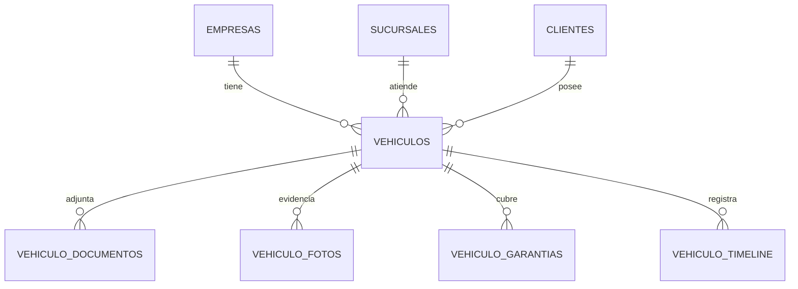

# M05 - Vehiculos

## Dependencias identificadas

- **M02 Empresas/Sucursales:** tenant y sucursal operativa.
- **M03 RBAC:** permisos `VEHICULOS:*`.
- **M04 Clientes:** cada vehiculo pertenece a un cliente del tenant actual.
- **Modulos futuros:** citas, recepciones, diagnosticos, OT, repuestos y facturas. M05 deja `vehiculo_timeline` para registrar eventos cuando esos modulos existan.

## Historias de usuario y criterios de aceptacion

1. Como asesor quiero crear vehiculos asociados a clientes para operar recepcion y ordenes futuras.
   - Cliente obligatorio y del tenant actual.
   - Placa obligatoria y unica por empresa.
   - Kilometraje no puede ser negativo.

2. Como asesor quiero buscar vehiculos por placa, VIN, marca, modelo o cliente.
   - La busqueda solo retorna vehiculos de la empresa autenticada.
   - No muestra datos ficticios.

3. Como asesor quiero ver ficha tecnica del vehiculo.
   - Muestra placa/VIN/datos tecnicos/kilometraje.
   - Documentos, fotos, garantias y timeline muestran estados vacios cuando no hay datos.

4. Como administrador quiero desactivar vehiculos sin perder historial.
   - `DELETE /vehicles/{id}` cambia estado a `INACTIVO`.
   - Se registra auditoria y evento de timeline.

## Modelo entidad-relacion



Migracion:

- `V6__m05_vehicles.sql`
  - `vehiculos`
  - `vehiculo_documentos`
  - `vehiculo_fotos`
  - `vehiculo_garantias`
  - `vehiculo_timeline`

## API REST y contratos DTO

- `GET /api/v1/vehicles?q=`
- `GET /api/v1/vehicles/{id}`
- `POST /api/v1/vehicles`
- `PUT /api/v1/vehicles/{id}`
- `DELETE /api/v1/vehicles/{id}`
- `POST /api/v1/vehicles/{id}/documents`
- `POST /api/v1/vehicles/{id}/photos`
- `POST /api/v1/vehicles/{id}/warranties`

DTOs:

- `VehicleRequest`, `VehicleResponse`
- `VehicleDocumentRequest`, `VehicleDocumentResponse`
- `VehiclePhotoRequest`, `VehiclePhotoResponse`
- `VehicleWarrantyRequest`, `VehicleWarrantyResponse`
- `VehicleTimelineResponse`, `Vehicle360Response`

## Servicios de dominio y reglas

- `VehicleService` valida tenant, cliente y sucursal.
- `VehicleClient360Adapter` conecta M05 con la Ficha 360 de Clientes:
  - muestra vehiculos asociados.
  - permite busqueda de clientes por placa.
- Los modulos futuros escribiran en `vehiculo_timeline` mediante servicios dedicados cuando existan.

## Pantallas/componentes

- `frontend/src/app/vehiculos/page.tsx`
  - Busqueda por texto.
  - Alta de vehiculo asociado a cliente.
  - Ficha tecnica responsive.
  - Estados vacios para documentos, fotos, garantias y timeline.

## Matriz de permisos

| Recurso | VER | CREAR | EDITAR | ELIMINAR | EXPORTAR |
| --- | --- | --- | --- | --- | --- |
| VEHICULOS | Lista/Ficha | Crear | Editar/documentos/fotos/garantias | Desactivar | Futuro |

## Eventos/auditoria

- `VEHICULOS:CREAR` en `vehiculos`
- `VEHICULOS:EDITAR` en `vehiculos`
- `VEHICULOS:ELIMINAR` en `vehiculos`
- `VEHICULOS:EDITAR` en documentos/fotos/garantias

Tambien se crea timeline tecnico para altas, ediciones, documentos, fotos, garantias y desactivaciones.

## Pruebas

Unitarias:

- `VehicleServiceValidationTest`: documenta la regla de kilometraje no negativo.

Pendientes para integracion/Testcontainers:

- CRUD vehiculo con Postgres.
- Placa duplicada por empresa falla.
- Cliente de otra empresa retorna 403.
- Ficha 360 de cliente muestra vehiculos reales.
- E2E: login, crear cliente, crear vehiculo, abrir ficha tecnica.

## Ejecucion

```bash
docker compose -f infra/docker-compose.yml up --build
```

Ruta frontend:

```text
/vehiculos
```
