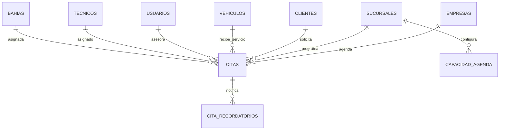

# M06 - Agenda y citas

## Dependencias identificadas

- M02 Empresas y sucursales: `empresa_id`, `sucursal_id`, selector de sucursal y frontera de tenant.
- M03 Usuarios, roles y permisos: permisos `CITAS:*`, asesor autenticado y auditoria.
- M04 Clientes: cada cita referencia un cliente activo del tenant.
- M05 Vehiculos: cada cita referencia un vehiculo del mismo cliente y tenant.
- M07 Recepcion: `ReceptionPort` crea o reutiliza recepciones digitales desde una cita.

## Historias de usuario y criterios de aceptacion

- Como asesor, quiero crear citas con cliente, vehiculo, servicio, fecha, duracion y notas para organizar la agenda.
  - La cita exige sucursal, cliente, vehiculo, servicio y fecha de inicio.
  - El vehiculo debe pertenecer al cliente seleccionado.
  - El registro queda limitado a la empresa y sucursal autorizada.
- Como jefe de taller, quiero ver agenda diaria, semanal y mensual para coordinar capacidad.
  - El calendario filtra por rango y sucursal.
  - Las citas muestran estado, cliente, placa y alerta de sobrecapacidad.
- Como asesor, quiero confirmar, cancelar, marcar llegada o no asistencia.
  - Solo se aceptan estados `PROGRAMADA`, `CONFIRMADA`, `LLEGO`, `CANCELADA` y `NO_ASISTIO`.
  - Cada cambio genera auditoria.
- Como operacion, quiero convertir una cita en recepcion.
  - La conversion usa un puerto de dominio hacia M07.
  - Si ya existe recepcion para la cita, se reutiliza.

## Modelo entidad-relacion



La migracion `V7__m06_appointments.sql` crea `tecnicos`, `bahias`, `capacidad_agenda`, `citas`, `cita_recordatorios` e inserta permisos `CITAS` para `VER`, `CREAR`, `EDITAR`, `ELIMINAR`, `APROBAR`, `ASIGNAR`, `EXPORTAR` y `ANULAR`.

## API REST y DTO

- `GET /api/v1/appointments?start=&end=&branchId=&view=`: calendario.
- `GET /api/v1/appointments/capacity?branchId=&start=&end=`: capacidad y sobrecapacidad.
- `POST /api/v1/appointments`: crea cita.
- `PUT /api/v1/appointments/{id}`: actualiza cita.
- `PATCH /api/v1/appointments/{id}/state?state=CONFIRMADA`: cambia estado.
- `DELETE /api/v1/appointments/{id}`: cancela cita.
- `GET /api/v1/appointments/{id}/reminders`: lista recordatorios.
- `POST /api/v1/appointments/{id}/reminders`: agenda recordatorio.
- `POST /api/v1/appointments/{id}/convert-to-reception`: reserva conversion a recepcion.
- `GET /api/v1/appointments/technicians`: lista tecnicos activos del tenant.
- `GET /api/v1/appointments/bays?branchId=`: lista bahias activas de la sucursal.
- `GET /api/v1/appointments/capacity-rules?branchId=`: lista reglas de capacidad configuradas.

DTO principal:

```json
{
  "sucursalId": "uuid",
  "clienteId": "uuid",
  "vehiculoId": "uuid",
  "asesorId": "uuid",
  "tecnicoId": "uuid",
  "bahiaId": "uuid",
  "servicio": "Cambio de aceite",
  "fechaInicio": "2026-09-17T14:00:00Z",
  "duracionMinutos": 60,
  "estado": "PROGRAMADA",
  "notas": "Cliente espera"
}
```

## Servicios de dominio y reglas

- `AppointmentService` centraliza agenda, capacidad, recordatorios y conversion.
- `TenantGuard` valida que la sucursal pertenezca al usuario actual.
- Los repositorios siempre filtran por `empresa_id`.
- La sobrecapacidad se calcula con citas traslapadas que no esten canceladas ni marcadas como no asistencia.
- Si no existe configuracion de capacidad para el dia, se asume capacidad minima `1`.

## Pantallas responsive

- Ruta frontend: `/citas`.
- Incluye selector de vista diaria, semanal y mensual.
- Permite filtrar por sucursal y fecha base.
- Muestra estado vacio cuando no hay citas.
- Formulario responsive para crear citas con cliente, vehiculo, servicio, fecha/hora, duracion y notas.
- Acciones rapidas: confirmar, llego, no asistio, cancelar y convertir a recepcion.

## Matriz de permisos

| Recurso | VER | CREAR | EDITAR | ELIMINAR | APROBAR | ASIGNAR | EXPORTAR | ANULAR |
| --- | --- | --- | --- | --- | --- | --- | --- | --- |
| CITAS | Ver calendario, capacidad y recordatorios | Crear citas y recordatorios | Cambiar datos y estado | Cancelar cita | Convertir a recepcion | Asignar tecnico/bahia | Exportar agenda futuro | Anular flujo futuro |

## Eventos y auditoria

- `CITAS:CREAR` en `citas`.
- `CITAS:EDITAR` en cambios de datos y estado.
- `CITAS:CREAR` en `cita_recordatorios`.
- `CITAS:APROBAR` al convertir a recepcion.

Cada evento guarda antes/despues cuando aplica y usa el usuario autenticado desde el contexto de seguridad.

## Pruebas

- Unitarias/contrato: estados operativos esperados en `AppointmentServiceValidationTest`.
- Integracion esperada: migracion Flyway `V7__m06_appointments.sql`.
- Seguridad multi-tenant: endpoints usan `@PreAuthorize("@perm.has(..., 'CITAS:*')")` y servicio valida empresa/sucursal.
- E2E sugerida: login, entrar a `/citas`, crear cita, confirmar, marcar llegada y convertir a recepcion.

## Errores y estados vacios

- `400`: campos obligatorios, rango invalido o estado no permitido.
- `403`: cita, cliente, vehiculo o sucursal fuera del tenant.
- Estado vacio frontend: "No hay citas en el rango seleccionado."
- Sobrecapacidad: se devuelve `sobrecapacidad=true` y el frontend muestra alerta.

## Ejecutar y probar

```bash
cd backend
./mvnw test
```

```bash
cd frontend
npm install
npm run build
```

Con Docker:

```bash
docker compose -f infra/docker-compose.yml up --build
```
