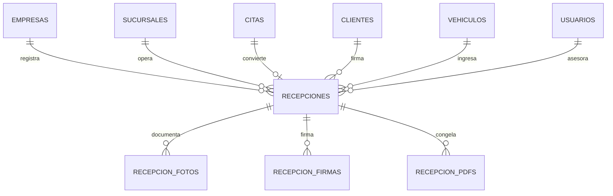

# M07 - Recepcion digital

## Dependencias identificadas

- M02 Empresas y sucursales: la recepcion pertenece a empresa y sucursal; `TenantGuard` valida acceso.
- M03 Usuarios, roles y permisos: permisos `RECEPCION:*` y auditoria.
- M04 Clientes: cada recepcion referencia un cliente del tenant.
- M05 Vehiculos: cada recepcion referencia un vehiculo del cliente y valida kilometraje.
- M06 Agenda y citas: una cita puede convertirse en recepcion mediante `ReceptionPort`.
- M08 Ordenes de trabajo: aun no existe. Se deja `WorkOrderPort` con stub `PendingWorkOrderPort`.

## Historias de usuario y criterios de aceptacion

- Como asesor, quiero registrar una recepcion desde movil para documentar el estado del vehiculo.
  - Debe capturar cliente, vehiculo, kilometraje, combustible, motivo y observaciones.
  - Debe validar que el vehiculo pertenezca al cliente y tenant actual.
  - El kilometraje no puede ser menor al kilometraje registrado del vehiculo.
- Como asesor, quiero registrar accesorios, checklist y mapa de danos.
  - Accesorios, checklist y danos quedan versionados como JSON en la recepcion.
  - Los danos incluyen zona, coordenadas, severidad y descripcion.
- Como asesor, quiero agregar fotos con metadatos.
  - La API recibe URL/base64, nombre, tipo, tamano original/comprimido, dimensiones y metadatos.
  - No se permite agregar fotos a una recepcion firmada.
- Como cliente, quiero firmar digitalmente la recepcion.
  - Al firmar se genera firma, hash, PDF y version firmada.
  - La recepcion firmada queda congelada y no permite edicion.
- Como jefe de taller, quiero crear una OT desde recepcion.
  - Solo recepciones firmadas pueden convertirse a OT.
  - Mientras M08 no exista, se reserva un identificador mediante `WorkOrderPort`.

## Modelo entidad-relacion



La migracion `V8__m07_reception.sql` crea `recepciones`, `recepcion_fotos`, `recepcion_firmas`, `recepcion_pdfs` y permisos `RECEPCION` para `VER`, `CREAR`, `EDITAR`, `ELIMINAR`, `APROBAR`, `ASIGNAR`, `EXPORTAR` y `ANULAR`.

## API REST y contratos DTO

- `GET /api/v1/receptions?branchId=&q=`: lista recepciones por sucursal y busqueda.
- `GET /api/v1/receptions/{id}`: detalle con fotos, firmas y PDF.
- `POST /api/v1/receptions`: crea recepcion.
- `PUT /api/v1/receptions/{id}`: actualiza recepcion en borrador.
- `DELETE /api/v1/receptions/{id}`: anula recepcion.
- `POST /api/v1/receptions/{id}/photos`: agrega foto/metadatos.
- `POST /api/v1/receptions/{id}/sign`: firma, genera PDF y congela.
- `POST /api/v1/receptions/{id}/work-order`: crea/reserva OT.

DTO principal:

```json
{
  "sucursalId": "uuid",
  "citaId": "uuid",
  "clienteId": "uuid",
  "vehiculoId": "uuid",
  "asesorId": "uuid",
  "kilometraje": 120000,
  "combustiblePorcentaje": 50,
  "motivo": "Revision general",
  "accesorios": [{ "nombre": "Llaves", "presente": true, "observacion": null }],
  "checklist": [{ "codigo": "LUCES", "etiqueta": "Luces", "ok": true, "observacion": null }],
  "danos": [{ "zona": "Frente", "x": 30, "y": 40, "severidad": "MEDIA", "descripcion": "Rayon" }],
  "observaciones": "Cliente espera"
}
```

## Servicios de dominio y reglas

- `ReceptionService` implementa `ReceptionPort` para convertir citas desde M06.
- Estados: `BORRADOR`, `FIRMADA`, `CONVERTIDA_OT`, `ANULADA`.
- Solo `BORRADOR` permite edicion y fotos.
- Firma genera `ReceptionSignature`, `ReceptionPdf`, hash SHA-256 y bloquea cambios.
- PDF se genera como documento PDF simple y se almacena en base64 con URL logica `reception://`.
- `WorkOrderPort` queda como interfaz para M08.

## Pantallas responsive

- Ruta frontend: `/recepcion`.
- Diseno mobile-first con listado, busqueda, formulario de recepcion, checklist, accesorios, danos, fotos, firma y descarga de PDF.
- Estados vacios:
  - Sin recepciones para la sucursal.
  - Sin fotos registradas.
  - Sin danos marcados.

## Matriz de permisos

| Recurso | VER | CREAR | EDITAR | ELIMINAR | APROBAR | ASIGNAR | EXPORTAR | ANULAR |
| --- | --- | --- | --- | --- | --- | --- | --- | --- |
| RECEPCION | Ver listado/detalle/PDF | Crear recepcion | Editar borrador y fotos | Uso futuro | Firmar y crear OT | Uso futuro | Descargar/exportar PDF | Anular recepcion |

## Eventos y auditoria

- `RECEPCION:CREAR` en `recepciones`.
- `RECEPCION:EDITAR` en `recepciones` y `recepcion_fotos`.
- `RECEPCION:APROBAR` al firmar o crear OT.
- `RECEPCION:ANULAR` al anular.

## Pruebas

- Unitarias/contrato: `ReceptionServiceValidationTest`.
- Integracion esperada: Flyway `V8__m07_reception.sql`.
- Seguridad multi-tenant: todos los endpoints tienen `@PreAuthorize` y el servicio filtra por `empresa_id` y sucursal autorizada.
- E2E sugerida: login, abrir `/recepcion`, crear recepcion, agregar foto, firmar, descargar PDF y crear OT.

## Manejo de errores

- `400`: combustible fuera de rango, kilometraje menor al vehiculo, recepcion firmada modificada, firma incompleta.
- `403`: cliente, vehiculo, cita, recepcion o sucursal fuera del tenant.
- `404` logico: los repositorios devuelven acceso denegado para no filtrar informacion entre tenants.

## Ejecutar y probar

```bash
cd backend
./mvnw test
```

```bash
cd frontend
npm install
npm run build
```

Con Docker:

```bash
docker compose -f infra/docker-compose.yml up --build
```
