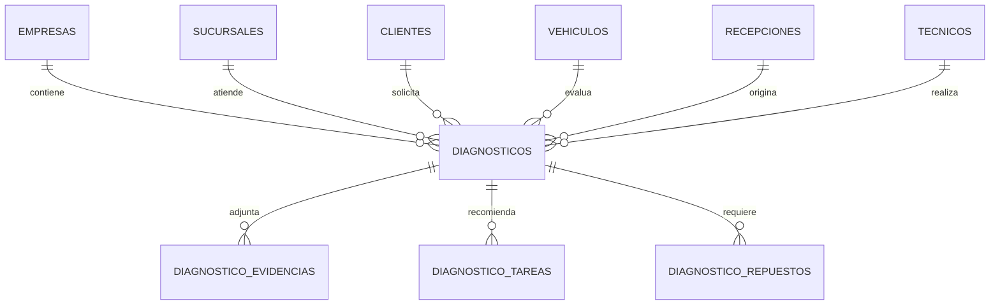

# M08 - Diagnostico tecnico

## Dependencias identificadas

- M02 Empresas y sucursales: el diagnostico pertenece a empresa y sucursal; `TenantGuard` valida acceso.
- M03 Usuarios, roles y permisos: permisos `DIAGNOSTICOS:*` y auditoria.
- M04 Clientes: cada diagnostico referencia un cliente del tenant.
- M05 Vehiculos: cada diagnostico referencia un vehiculo del cliente.
- M06/M07: puede vincularse a recepcion si existe.
- Ordenes de trabajo: aun no existe como modulo persistente. Se deja `WorkOrderSnapshotPort` como interfaz; el stub `PendingWorkOrderSnapshotPort` no inventa datos y permite crear diagnosticos asociados a un `ordenTrabajoId` enviado por el cliente hasta que el modulo real valide la OT.

## Historias de usuario y criterios de aceptacion

- Como tecnico, quiero registrar sintomas, DTC, pruebas y hallazgos por OT para sustentar el diagnostico.
  - El diagnostico exige sucursal, OT, cliente y vehiculo.
  - El vehiculo debe pertenecer al cliente seleccionado y al tenant.
  - La sucursal debe estar autorizada para el usuario.
- Como tecnico, quiero adjuntar foto, video o audio como evidencia.
  - Cada evidencia guarda tipo, URL/base64, nombre, MIME, tamano y metadatos.
- Como tecnico, quiero proponer tareas, repuestos y tiempo estimado.
  - Las tareas y repuestos se agregan como registros independientes auditables.
- Como jefe de taller, quiero apoyo de IA como sugerencia no vinculante.
  - La IA solo sugiere causas/pruebas/repuestos.
  - La sugerencia marca `requiereConfirmacionTecnica=true`.
  - Solo una confirmacion tecnica cambia el diagnostico a `CONFIRMADO`.

## Modelo entidad-relacion



La migracion `V9__m08_diagnostics.sql` crea `diagnosticos`, `diagnostico_evidencias`, `diagnostico_tareas`, `diagnostico_repuestos`, permisos `DIAGNOSTICOS` y asigna esos permisos a roles administradores existentes.

## API REST y DTO

- `GET /api/v1/diagnostics?branchId=&q=`: lista diagnosticos.
- `GET /api/v1/diagnostics/{id}`: detalle con evidencias, tareas y repuestos.
- `POST /api/v1/diagnostics`: crea diagnostico.
- `PUT /api/v1/diagnostics/{id}`: actualiza diagnostico.
- `DELETE /api/v1/diagnostics/{id}`: anula diagnostico.
- `POST /api/v1/diagnostics/{id}/evidences`: adjunta foto/video/audio/documento.
- `POST /api/v1/diagnostics/{id}/tasks`: agrega tarea recomendada.
- `POST /api/v1/diagnostics/{id}/parts`: agrega repuesto recomendado.
- `POST /api/v1/diagnostics/{id}/ai-assist`: genera sugerencia IA pendiente.
- `POST /api/v1/diagnostics/{id}/ai-confirm`: confirma tecnicamente la sugerencia IA.

DTO principal:

```json
{
  "sucursalId": "uuid",
  "ordenTrabajoId": "uuid",
  "recepcionId": "uuid",
  "clienteId": "uuid",
  "vehiculoId": "uuid",
  "tecnicoId": "uuid",
  "sintomas": [{ "descripcion": "Vibracion", "severidad": "MEDIA", "condicion": "En marcha" }],
  "dtc": [{ "codigo": "P0300", "descripcion": "Misfire aleatorio", "modulo": "ECM", "estado": "ACTIVO" }],
  "hallazgos": [{ "descripcion": "Bobina con fuga", "evidencia": "foto", "impacto": "Falla intermitente" }],
  "causaProbable": "Falla de encendido",
  "solucionRecomendada": "Validar bobinas y bujias",
  "prioridad": "ALTA",
  "estado": "BORRADOR",
  "tiempoEstimadoMinutos": 90
}
```

## Servicios de dominio y reglas

- `DiagnosticService` centraliza CRUD, evidencias, tareas, repuestos e IA.
- Estados: `BORRADOR`, `EN_PROCESO`, `PENDIENTE_CONFIRMACION`, `CONFIRMADO`, `ANULADO`.
- Prioridades: `BAJA`, `MEDIA`, `ALTA`, `CRITICA`.
- Tipos de evidencia: `FOTO`, `VIDEO`, `AUDIO`, `DOCUMENTO`.
- La asistencia IA no modifica causa/solucion final; guarda sugerencia y exige confirmacion tecnica.

## Pantallas responsive

- Ruta frontend: `/diagnosticos`.
- Incluye listado, busqueda, alta rapida por OT, sintomas, DTC, hallazgos, evidencias multimedia, tareas, repuestos y panel de asistencia IA.
- Estados vacios: sin diagnosticos, sin evidencias, sin tareas, sin repuestos y sin sugerencia IA.

## Matriz de permisos

| Recurso | VER | CREAR | EDITAR | ELIMINAR | APROBAR | ASIGNAR | EXPORTAR | ANULAR |
| --- | --- | --- | --- | --- | --- | --- | --- | --- |
| DIAGNOSTICOS | Ver listado/detalle | Crear diagnostico | Editar, evidencias, tareas y repuestos | Uso futuro | IA y confirmacion tecnica | Asignar tecnico futuro | Exportar futuro | Anular diagnostico |

## Eventos y auditoria

- `DIAGNOSTICOS:CREAR` en `diagnosticos`.
- `DIAGNOSTICOS:EDITAR` en diagnostico, evidencias, tareas y repuestos.
- `DIAGNOSTICOS:APROBAR` en asistencia IA y confirmacion tecnica.
- `DIAGNOSTICOS:ANULAR` al anular.

## Pruebas

- Unitarias/contrato: `DiagnosticServiceValidationTest`.
- Integracion esperada: Flyway `V9__m08_diagnostics.sql`.
- Seguridad multi-tenant: endpoints protegidos con `@PreAuthorize` y servicio filtrando `empresa_id`/sucursal autorizada.
- E2E sugerida: login, abrir `/diagnosticos`, crear diagnostico, adjuntar evidencia, solicitar IA, confirmar sugerencia.

## Manejo de errores

- `400`: OT faltante, prioridad/estado/tipo de evidencia invalido, cantidad o tiempos negativos.
- `403`: sucursal, cliente, vehiculo, recepcion o diagnostico fuera del tenant.
- Estados vacios visibles en frontend.

## Ejecutar y probar

```bash
cd backend
./mvnw test
```

```bash
cd frontend
npm install
npm run build
```

Con Docker:

```bash
docker compose -f infra/docker-compose.yml up --build
```
