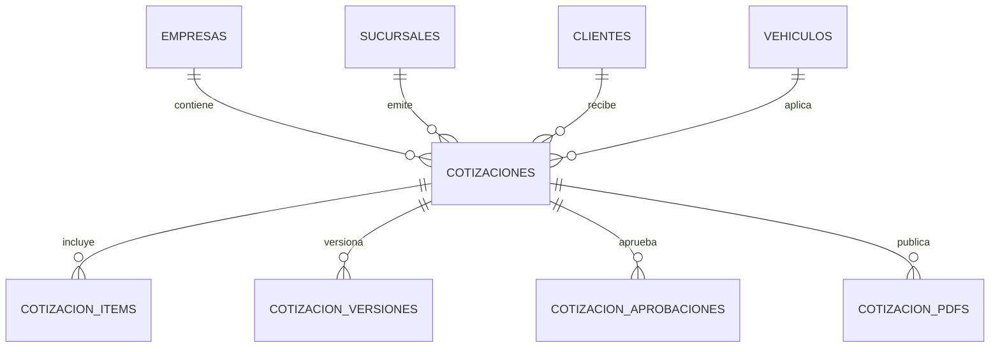

# M09 - Cotizaciones y aprobaciones

## Dependencias identificadas

- M02 Empresas y sucursales: cotizacion por empresa y sucursal, con `TenantGuard`.
- M03 Usuarios, roles y permisos: permisos `COTIZACIONES:*` y auditoria.
- M04 Clientes: la cotizacion pertenece a un cliente.
- M05 Vehiculos: la cotizacion referencia el vehiculo del cliente.
- OT futura: aun no existe modulo persistente. Se deja `QuoteWorkOrderPort` para generar trabajo solo con items aprobados; el stub reserva un identificador sin inventar operaciones.

## Historias de usuario y criterios de aceptacion

- Como asesor, quiero crear cotizaciones con servicios, mano de obra y repuestos.
  - Cada item tiene tipo, cantidad, valor, impuesto, descuento y total calculado en backend.
  - La cotizacion exige OT, cliente, vehiculo y al menos un item.
- Como asesor, quiero versionar cambios de cotizacion.
  - Cada edicion incrementa `version_actual`.
  - Se guarda snapshot en `cotizacion_versiones`.
- Como cliente, quiero aprobar todo, rechazar todo o aprobar parcialmente.
  - La aprobacion puede venir por item o por todos los items.
  - Se guarda evidencia de aprobacion.
  - El estado queda `APROBADA`, `RECHAZADA` o `APROBADA_PARCIAL`.
- Como jefe de taller, quiero generar trabajo solo con items aprobados.
  - Si no hay items aprobados, la API rechaza la generacion.
  - La generacion usa `QuoteWorkOrderPort`.

## Modelo entidad-relacion



La migracion `V10__m09_quotations.sql` crea tablas de cotizaciones, items, versiones, aprobaciones y PDFs. Tambien inserta permisos `COTIZACIONES` y los asigna a roles administradores existentes.

## API REST y DTO

- `GET /api/v1/quotations?branchId=&q=`: lista cotizaciones.
- `GET /api/v1/quotations/{id}`: detalle con items, versiones, aprobaciones y PDF.
- `GET /api/v1/quotations/public/{token}`: detalle publico por enlace.
- `POST /api/v1/quotations`: crea cotizacion.
- `PUT /api/v1/quotations/{id}`: crea nueva version.
- `POST /api/v1/quotations/{id}/send`: marca enviada.
- `POST /api/v1/quotations/{id}/approve`: aprueba/rechaza total o parcial.
- `POST /api/v1/quotations/public/{token}/approve`: aprobacion desde enlace cliente.
- `POST /api/v1/quotations/{id}/generate-work`: genera trabajo de items aprobados.
- `DELETE /api/v1/quotations/{id}`: anula.

DTO principal:

```json
{
  "sucursalId": "uuid",
  "ordenTrabajoId": "uuid",
  "clienteId": "uuid",
  "vehiculoId": "uuid",
  "venceEn": "2026-10-01",
  "moneda": "COP",
  "items": [
    {
      "tipo": "REPUESTO",
      "codigo": "FIL-001",
      "descripcion": "Filtro de aceite",
      "cantidad": 1,
      "valorUnitario": 45000,
      "impuestoPorcentaje": 19,
      "descuentoPorcentaje": 0
    }
  ]
}
```

## Servicios de dominio y reglas

- `QuotationService` calcula totales y descuentos siempre en backend.
- Tipos de item: `MANO_OBRA`, `SERVICIO`, `REPUESTO`.
- Acciones de aprobacion: `APROBAR`, `RECHAZAR`.
- Los descuentos se aplican antes de impuestos.
- Cada version genera snapshot y PDF simple.
- El enlace publico usa `public_token`.

## Pantallas responsive

- Ruta frontend: `/cotizaciones`.
- Permite listar, buscar, crear cotizacion, agregar items, ver totales, descargar PDF, aprobar todo, rechazar todo, aprobar/rechazar por item y generar trabajo.
- Estados vacios: sin cotizaciones y sin items.

## Matriz de permisos

| Recurso | VER | CREAR | EDITAR | ELIMINAR | APROBAR | ASIGNAR | EXPORTAR | ANULAR |
| --- | --- | --- | --- | --- | --- | --- | --- | --- |
| COTIZACIONES | Ver listado/detalle/PDF | Crear | Versionar/enviar | Uso futuro | Aprobar y generar trabajo | Uso futuro | Exportar futuro | Anular |

## Eventos y auditoria

- `COTIZACIONES:CREAR` en `cotizaciones`.
- `COTIZACIONES:EDITAR` al versionar/enviar.
- `COTIZACIONES:APROBAR` al aprobar/rechazar/generar trabajo.
- `COTIZACIONES:ANULAR` al anular.

## Pruebas

- Unitarias/contrato: `QuotationServiceValidationTest`.
- Integracion esperada: Flyway `V10__m09_quotations.sql`.
- Seguridad multi-tenant: endpoints internos protegidos por `@PreAuthorize`; servicio filtra empresa/sucursal.
- E2E sugerida: login, abrir `/cotizaciones`, crear, aprobar item, generar trabajo.

## Manejo de errores

- `400`: item vacio, tipo/accion invalido, cantidades o valores negativos, generar trabajo sin items aprobados.
- `403`: cliente, vehiculo, sucursal o cotizacion fuera del tenant.
- Estados vacios visibles en frontend.

## Ejecutar y probar

```bash
cd backend
./mvnw test
```

```bash
cd frontend
npm install
npm run build
```

Con Docker:

```bash
docker compose -f infra/docker-compose.yml up --build
```
